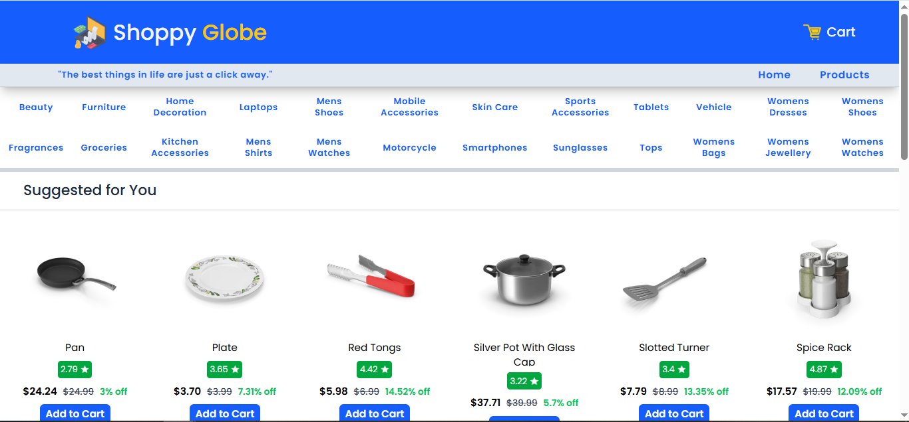
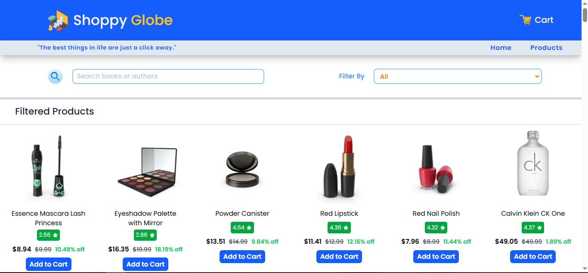
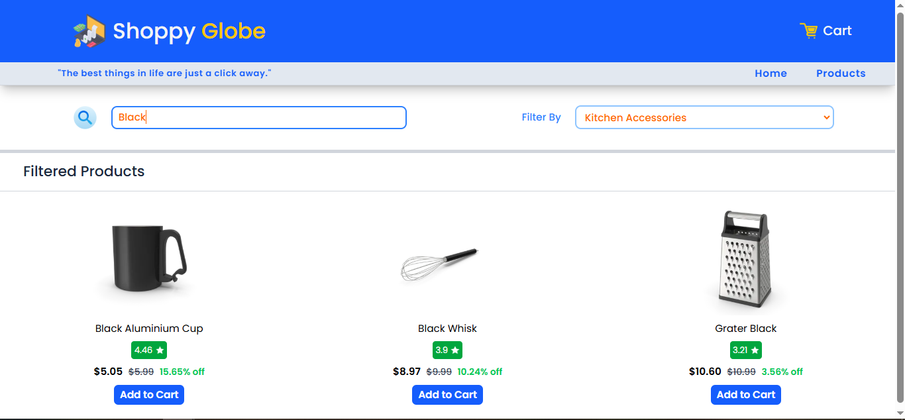
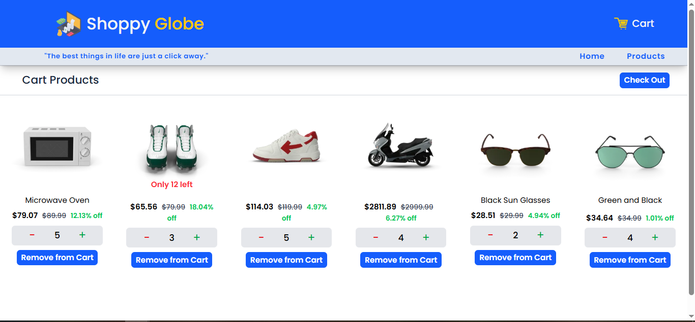
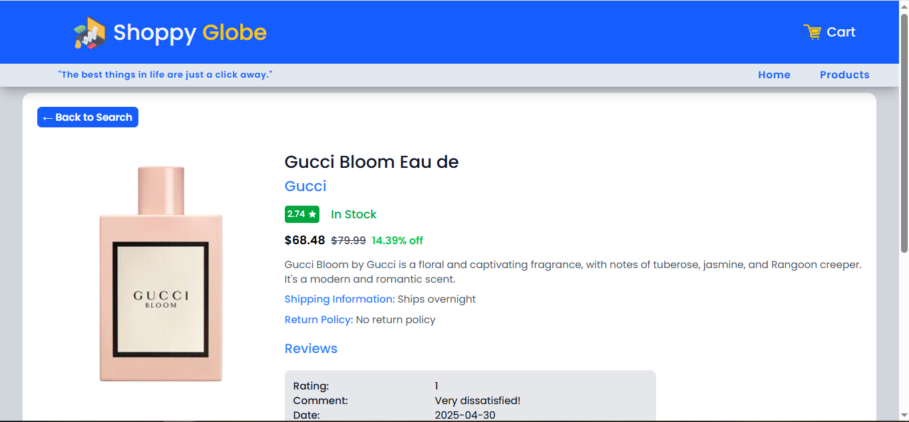
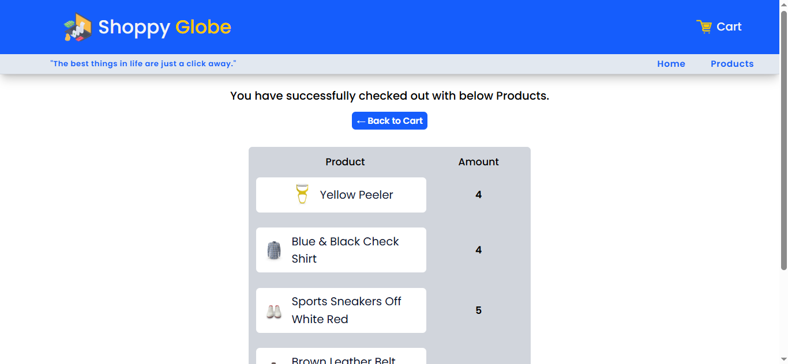

---

```markdown
# 🛒 Shoppy Globe

**Shoppy Globe** is a fast, responsive e-commerce web app built with React, Vite, and Tailwind CSS. It allows users to browse products, filter by category, search in real-time, and manage a shopping cart seamlessly.

---

## 🚀 Features

- ⚡ Lightning-fast performance with **Vite**
- 🎨 Stylish and responsive UI using **Tailwind CSS**
- 🔍 Real-time **search and category filtering**
- 🛍️ Dynamic **product detail pages**
- 🛒 Fully functional **shopping cart**
- 💾 State management via **Redux Toolkit**
- ❌ Graceful handling of empty/error states

---

## 🧱 Project Structure (Summarized)

```
Shoppy-Globe/
├── public/images/           # Icon and static assets
├── src/
│   ├── components/          # React components (Cart, Navbar, Products, etc.)
│   ├── utils/               # Redux slices and custom hooks (store.js, slices)
│   ├── App.jsx              # Main app component
│   ├── main.jsx             # Entry point
│   ├── index.css, App.css   # Global styles
├── README.md, LICENSE       # Project docs
├── vite.config.js           # Vite configuration
└── package.json             # Project metadata
```

---

## 🛠️ Tech Stack

- **React** + **Vite** – For a blazing-fast frontend
- **Tailwind CSS** – For modern utility-first styling
- **Redux Toolkit** – For predictable state management
- **React Router DOM** – For client-side routing

---

## 🧪 Getting Started

1. **Clone the repo**
   ```bash
   git clone https://github.com/your-username/shoppy-globe.git
   cd shoppy-globe
   ```

2. **Install dependencies**
   ```bash
   npm install
   ```

3. **Run the app**
   ```bash
   npm run dev
   ```

4. Open in browser at: [http://localhost:5173](http://localhost:5173)

---

## 📸 Screenshots

1. **Home Page**

    

2. **All Products**

    

3. **Filtered Products**

    

4. **Cart Page**

    

5. **Product Details Page**

    

6. **Checkout Page**

    

---

## 📄 License

This project is licensed under the MIT License.

---

## ✨ Future Enhancements

- ✅ Add wishlist functionality
- ✅ Add Backend
- ✅ Integrate payment gateway
- ✅ Add product reviews

---

## 🙌 Acknowledgements

- Icons from `/public/images`
- UI design inspired by modern e-commerce layouts

---

## 👋 Connect

Built with ❤️ by [Rohit Varma datla](https://github.com/visaal1582892)
```